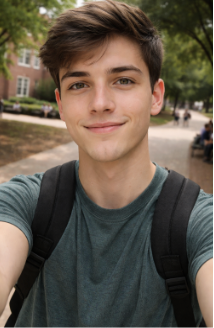
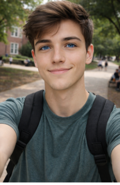

# Week 3: Selfie & Identity

## The Artifact

	<figure>
		
		<figcaption>AI-generated selfie based on my initial description.</figcaption>
	</figure>
	<figure>
		
		<figcaption>Second version with blue eyes to test how AI alters identity.</figcaption>
	</figure>

## Project Notes
I made this by giving ChatGPT a picture of myself and a brief description of my appearance so it could generate a selfie. I only used ChatGPT for the make. I chose to change my eye color to see how AI responds to a small change and whether it would fill in other details about what I look like based on that adjustment.

> **Process note:** I kept the prompt short on purpose so I could see what the AI would assume without extra direction.

## Reflection
I tried to see how AI would translate my identity into an image, so I fed ChatGPT a photo and a short description of my appearance. The first result failed in a surprising way: it looked like a stock “college student” instead of me. The face felt interchangeable, and the setting was so generic that it erased the details I thought mattered. That failure pushed me to tweak a single trait — changing my eye color to blue — to test how sensitive the system was to small edits. The second version changed a lot more than just eye color, which made it clear that AI isn’t “remembering” me; it’s assembling a template from patterns it already knows. I used AI as the image generator, but the experiment was really about prompting and comparing. What I learned about AI and creativity is that the system is good at producing plausible surfaces, but it doesn’t understand identity as lived experience. Creativity here became a critical act of selection: I had to decide which details mattered and then interpret what the omissions revealed. The project taught me that AI can mimic a person’s look, but it struggles to capture what makes that person specific.

<h3>Attribution</h3>

<strong>Tools Used:</strong> ChatGPT (image generation)

<strong>Prompt(s):</strong> “Create a selfie of a 19-year-old college student based on my description.” “Now change the eye color to blue.”

<strong>AI Contribution:</strong> Generated two image variations from my prompts.

<strong>Human Contribution:</strong> Chose the prompts, compared outputs, and wrote the reflection on identity.

<strong>Sources:</strong> None

