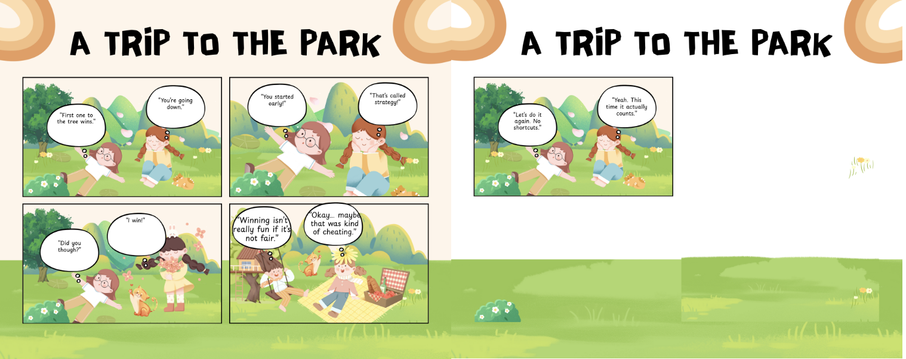

# Week 4 – Comic & Storytelling

## The Artifact

*Comic strip about fairness and effort in competition.*

## Process Notes
I made this in Canva and used a bit of ChatGPT to help me plan it out. I decided everything about the comic, with AI only helping during brainstorming.

## Reflection
For this comic, I wanted to show a simple moment between two friends playing and racing each other. On the surface, it looks like light competition, but it’s really about effort and fairness. When one of them cheats a little to win, it makes the victory feel less meaningful because of how it was achieved. The focus shifts from just winning to how the win actually happens and what it says about the players. By the last panel, the characters decide to race again “for real,” which shows that actually trying is what makes the experience feel real or “true.” It’s not just about the outcome, but about doing it in a fair and honest way. That idea is what I wanted the comic to communicate overall. Even though the story itself isn’t about AI, I did use AI to help me come up with the final captions for what the characters would say. I asked for a few different options and then chose the ones that best matched the tone and meaning I was going for. The characters and the idea behind the comic were mine, but AI helped me refine the wording and make the dialogue clearer. That process made me realize that AI works best for me as a tool rather than as the creator. If it had written the entire comic, it probably wouldn’t feel as personal or connected to what I actually wanted to express. This project showed me that meaning mainly comes from the choices I make—AI can suggest possibilities, but I’m the one who decides what fits and what doesn’t.

## Attribution & AI Use
- Tools used: Canvas and ChatGTP.
- AI prompts (summary): I gave AI my idea for a commic and then had AI come up with the dialog for my comic. 
- What AI generated: It gave me the correct dialogue that made sense for my comic strip.
- What you changed or decided: I decided to change what the characters said and when in certain slides of the strip.