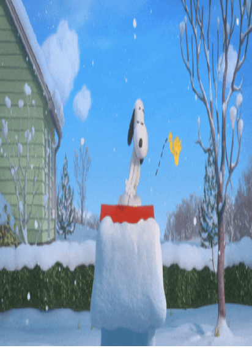

# Week 5 – GIF & Remix Culture

## The Artifact

*Looping Snoopy GIF frame showing the repeated motion.*

## Process Notes
I used an AI-generated image and then looped it into a GIF. I decided everything about the loop, while AI handled the looping.

## Reflection
When an image repeats instead of staying still, it starts to feel different. At first, Snoopy jumping on the doghouse feels fun and playful, like a normal cartoon moment that captures a small burst of energy. It has a sense of spontaneity, almost like a snapshot of movement. But once it starts looping, that feeling changes. The jump doesn’t feel as unexpected anymore—it begins to feel automatic, as if it’s stuck in a continuous cycle. The butterfly flying in circles underneath strengthens that effect because it never breaks its pattern. Both motions repeat in a way that removes variation, and over time the scene feels less like a single moment and more like a system running on repeat. The loop makes you notice the structure of the animation instead of just the scene itself. After watching it a few times, it feels less like a cute, lively interaction and more like something programmed. The repetition reduces surprise and turns what initially felt playful into something patterned and predictable. At the same time, my choices are still present in the work. I decided on Snoopy as the character, how high he jumps, how fast the butterfly moves, and how long the loop lasts. Even if AI helped generate parts of the image, I still shaped how it behaves and what gets repeated. The smoothness of the loop also reflects automation—it doesn’t adapt or change, it just continues endlessly. Since Snoopy comes from Peanuts, this GIF is already a kind of remix. Using AI adds another layer to that, because it isn’t the original drawing by Charles Schulz, but a new version created through prompts and reinterpretation. That makes authorship more complex, since the final piece is partly mine, partly AI-generated, and partly based on an existing cultural work.

## Attribution & AI Use
- Tools used: ChatGTP.
- AI prompts (summary):  “Make snoopy jump” , “Make him play with the butterfly” , “Make the loop 3-10 sentences"
- What AI generated: A gif of snoopy playing with a butterfly on the red dog house. 
- What you changed or decided: Animated Snoopy jumping, added butterfly motion, created a looping sequence, and adjusted the timing.