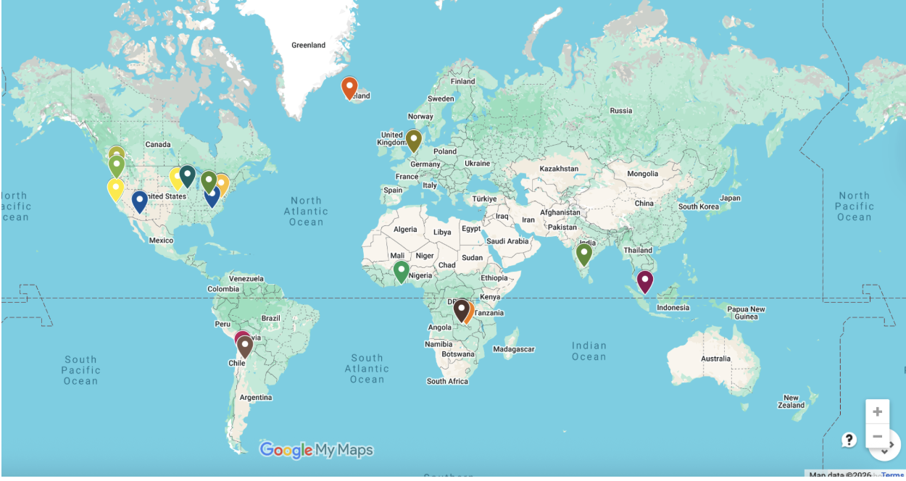

# Week 7 – Mapping AI Worlds

## The Artifact

*Map of AI infrastructure, labor sites, and resource locations.*

## Process Notes
I made this by getting specific locations from ChatGPT and then adding them to my map in GoogleMaps. I decided which locations were important enough to include.

## Reflection
AI reshapes global geographies of power, labor, and the environment by concentrating control in a small number of powerful places while distributing the costs across much wider regions. Most of the most advanced AI systems are developed by large companies like OpenAI and Google, which are mainly based in the United States, along with increasing competition from China. This centralization means that a relatively small group of organizations and countries has a lot of influence over how AI is designed, trained, and deployed, which can reinforce existing global inequalities in power and access. At the same time, a lot of the labor that makes AI systems work is less visible and often outsourced. Tasks like data labeling, content moderation, and training support are frequently done in countries such as Kenya and India, where workers may be underpaid and their contributions are not widely recognized. Even though this work is essential for AI systems to function properly, it is often treated as background labor rather than a central part of the technology. AI also has environmental impacts that are spread unevenly around the world. It depends on large data centers that use significant amounts of electricity and water, as well as hardware that relies on mined materials from places like the Democratic Republic of the Congo. This means that environmental costs are often shifted away from the companies and countries that benefit most from AI development. Overall, AI tends to concentrate benefits, infrastructure, and decision-making power at the top, while distributing labor and environmental costs globally in ways that are less visible but deeply important.

## Attribution & AI Use
- Tools used: GoogleMaps and ChatGPT.
- AI prompts (summary): I would ask it to give me the exact locations of the spots I needed at the time.
- What AI generated:It gave me the exact locations of corporate headquarters, data centers, mining sites, and content moderation and data labeling labor.
- What you changed or decided: I decided which locations and coordinates to use in my map and which ones fit best with the structure of my map.