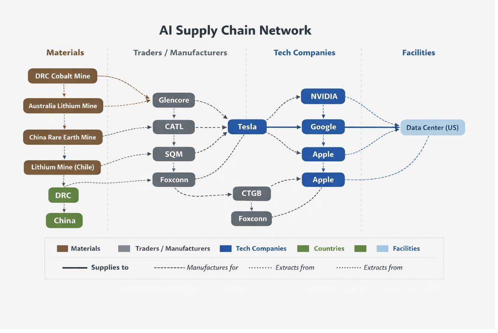

# Week 8 – Networks of Knowledge & Power

## The Artifact

*Network chain sketch translated into a digital image.*

## Process Notes
I identified the sources, targets, relationship types, and node types, then connected them into a “chain.” After sketching the idea on paper, I sent it to AI to turn it into an image for my project. I used pen and paper, ChatGPT, and several corporate websites, and I decided which sources to include, the structure, and what appeared in the final network.

## Reflection
In AI networks, some people and organizations are often highly visible, such as big tech companies, well-known researchers, and large, well-funded projects. At the same time, smaller groups, independent researchers, and communities that are affected by AI systems are often much less visible, or sometimes not shown at all. This creates an uneven picture of who is actually involved in and impacted by AI development.

Visualizations of these networks can sometimes help share power by making relationships and influence more visible. They can highlight who is central in a system, who is connected to whom, and how ideas or resources flow across different actors. In that sense, they can be useful tools for understanding complex structures that would otherwise be difficult to see. However, these visualizations can also hide power depending on what data is used to build them. If the map is based mainly on things like funding, citations, or formal collaborations, it may leave out informal contributors, smaller organizations, or communities that are still affected by AI but not captured in official records. Because of this, what appears on the map is not neutral. Ultimately, who shows up in a network visualization depends on the data that is collected and the choices made by the person creating it. These design decisions shape the final image, meaning that network visuals can make certain actors seem more central or important while unintentionally leaving others out or making them less visible.

## Attribution & AI Use
- Tools used: ChatGTP.
- AI prompts (summary): I drew my chain on a piece of paper, then sent it to AI and asked it to turn it into a cartoon image so I could use it online.
- What AI generated: My final networkings chain.
- What you changed or decided: I decided everything about the final chain and what to include in it.