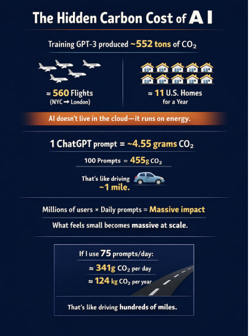

# Week 12: AI & Ecology

## The Artifact

*Ecology-themed design exploring AI’s environmental impact.*

## Process Notes
I used ChatGPT to help plan my design, then used Canva to bring it to life. I used Canva and ChatGPT, and I decided what should be included in the image.

> **Process note:** I balanced one concrete data point with one visual metaphor so the design felt both grounded and readable.

## Reflection
I tried to design a visual that captures AI’s environmental trade-offs without turning it into a simple “good or bad” story. My first layout failed because it was cluttered — I crammed too many facts into one frame, and the message got lost. I used ChatGPT to help brainstorm a clearer structure, then I translated that outline into a cleaner Canva design with a central idea and supporting points. The AI helped with planning, but I had to choose which data points mattered and how to balance costs with potential benefits. This project taught me that AI can offer a starting blueprint, but creativity is still about editing and emphasis. I learned that when AI suggests everything, the human job is to decide what to leave out so the argument is readable. It also made me more aware of how design choices influence environmental narratives: if you lead with energy costs, the reader sees risk; if you lead with efficiency gains, they see opportunity. The final piece reflects my attempt to hold both at once and show that sustainability depends on human decisions about infrastructure, energy sources, and scale.

<h3>Attribution</h3>

<strong>Tools Used:</strong> Canva, ChatGPT

<strong>Prompt(s):</strong> “Outline a simple visual structure for explaining AI’s environmental costs and potential benefits.”

<strong>AI Contribution:</strong> Suggested a layout plan and possible talking points.

<strong>Human Contribution:</strong> Curated the points, designed the final graphic, and wrote the reflection.

<strong>Sources:</strong> Course materials on AI and ecology

